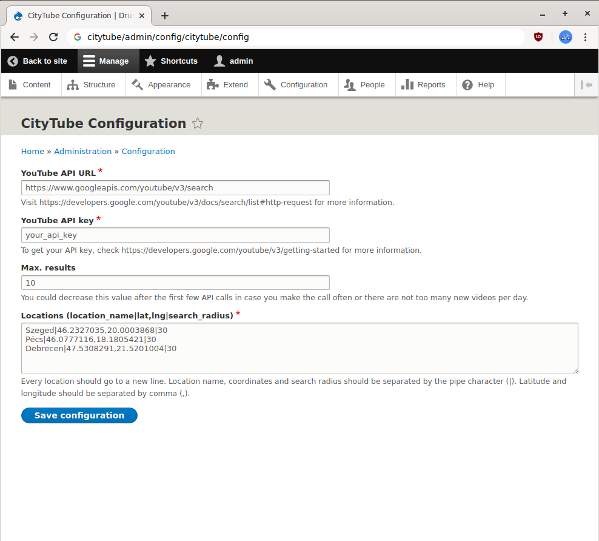

A Drupal module for creating nodes from YouTube videos which are related to a specific location and the surrounding area.

## Requirements

- Drupal 8.x
- [A YouTube Search API key](https://developers.google.com/youtube/v3/getting-started)

## What does this module do?

- Finds all the YouTube videos based on geolocation settings (latitude and longitude), if set by the video creator.
- Finds all the YouTube videos based on location name (basically just a city name search query).
- Stores the location as a taxonomy (`cities`) term.
- Creates a node from the YouTube video, and stores:
	- Video ID in `field_video_id`
	- Video Title in `title`
	- Video description in `body`
	- Video publishing time in `field_published`
	- Video thumbnail URL (high version) in `field_thumbnail_url`
	- Channel ID in `field_channel_id`
	- Channel name in `field_channel`
	- Connection with the taxonomy term in `field_city`

## Instructions

- Go to `/admin/config/citytube/config` and fill the required fields.
- In case your API key is invalid or you have exceeded your daily quota, an error message will inform you about the API error.
- In the **Locations** field, every location should go to a new line. Location name, coordinates and search radius should be separated by the pipe character (|). Latitude and longitude should be separated by comma (,). Example:

```
Szeged|46.2327035,20.0003864|30
Pécs|46.0777116,18.180542|30
Debrecen|47.5308291,21.5201|30
```



- To manually run the API call, go to this URL while you are logged in as administrator: `/citytube/manual_api_call`

  In case of errors, you will hopefully see a message here about what went wrong.

- Of course, every imported video has its own content node, list them by visiting this URL: `/admin/content?title=&type=citytube_video`

- The videos are unpublished by default, so you'll have to edit and publish them manually. There is usually a lot of junk in the search results, so it's not the best idea to publish them by default.

## TODO

- ~~Populating the nodes.~~
- Retrieving older results (based on the next page token).
- Think of a good cron solution for an automatic, periodical API call.
- ~~Configuration link on the module list.~~
- Frontend theme (currently in the making, check https://github.com/csisztaiarnold/citytube_theme)
  - Global page layout.
  - Menu.
  - Post preview layout.
  - Post page layout.
- Log error messages.
- Tests.

## Known issues

- In case CURL can't resolve an URL, try restarting the container (assuming you are using a Docker container for development).

## Credits

CityTube logo by [Igor Ivkovity](https://github.com/ivkovici).
